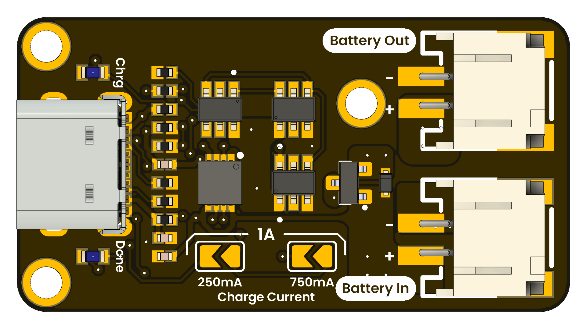

# CN3165 Battery Charger Module

This compact printed circuit board is designed to serve as a single-cell Li-Ion battery charger and power-out module. Its USB-C interface provides 5 V from any compliant source, powering an on-board charger IC that supports charging currents of 250 mA, 750 mA, or 1 A*. Two sets of terminals are available:

* **Battery In:** for charging the battery safely.
* **Battery Out:** for delivering battery voltage to a load even while the battery is charging.

<b>*The charging current will depend on the battery charge percentage</b>

<div align="center">
<a href="./cn3165_battery_charger_module.pdf"></a>
</div>


## Additional Resources

<div align="center">

| Resource              | Link                                                                                                                        |
|:---------------------:|:---------------------------------------------------------------------------------------------------------------------------:|
| Wiki-UNIT Electronics | [Wiki - UNIT Electronics](https://unit-electronics-mx.github.io/wiki_uelectronics/es/docs/Modules/cn3165)                   |
| Github Repository     | [Github Repository](https://github.com/UNIT-Electronics-MX/unit_cn3165_battery_charger_module)                              |
| Product Brief         | [Product brief]()                                                   |
| Schematic             | [Schematic](hardware/unit_sch_v_0_0_1_ue0089_cn3165_battery_charger.pdf)                                                           |

</div>

## Description 

### USB Power Input

The USB-C port accepts a 5 V supply from PCs, charger bricks, or power banks.

### Safety Features

Integrated safety measures include over-voltage, over-current protection up to 5A, and thermal shutdown.

### Output Features

Up to 3A output current from output terminals. The module can operate with currents above 3A with proper thermal management. Keep the module below 150°C to avoid permanent damage to the device.

# Pinout
<div align="center">
    <a href="#"><br/>Pinout</a>
    <br/>


</div>

---

<div align="center">

| Component         | PCB Label   | Description                                        |
|-------------------|-------------|----------------------------------------------------|
| USB-C Connector   | USB IN      | 5 V power input from USB-C source                  |
| Connector         | Battery IN  | JST PH2.0 for connecting the Li-ion cell     |
| Connector         | Battery Out | JST PH2.0 for outputting battery voltage     |
| CHRG LED          | CHRG        | Indicator LED: on during the charging phase        |
| DONE LED          | DONE        | Indicator LED: on when the charging cycle completes|
| Solder Bridge     | 250 mA       | Sets charging current to 250 mA                |
| Solder Bridge     | 750 mA       | Sets charging current to 750 mA; solder both bridges for 1 A |

</div>

## Documentation and Setup

### Overview
This repository contains firmware and documentation for integrating the Relay Module into your projects.

### Installation
1. Clone the repository:
   ```
   git@github.com:UNIT-Electronics-MX/unit_cn3165_battery_charger_module.git
   ```
2. Navigate to the project directory:
   ```
   cd ./unit_cn3165_battery_charger_module.git
   ```
3. Follow the platform-specific setup instructions detailed in the project documentation.

### Usage
Include the module initialization and configuration routines in your main project file. Sample code snippets and detailed explanations can be found in the documentation folder of the repository.


## Support
For any issues or further assistance, please open an issue on the GitHub repository or contact our support team.


# License MIT 
This project is licensed under the MIT License - see the [LICENSE](LICENSE) file for details.

# Resources

- [Schematic PDF](hardware/unit_sch_v_0_0_1_ue0089_cn3165_battery_charger.pdf)
- [Product brief](./cn3165_battery_charger_module.pdf)
