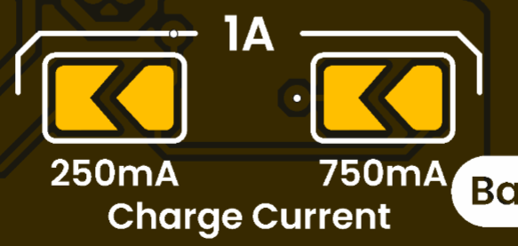
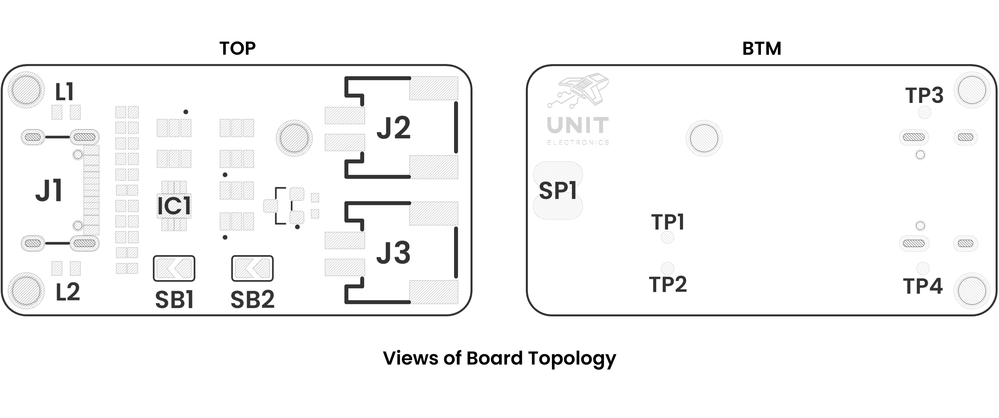

# Hardware

<a href="unit_sch_v_0_0_1_ue0089_cn3165_battery_charger.pdf">  Schematics</a>

> **Documentation Status**: Auto-updated via GitHub Actions workflow  
> **Last Updated**: Enhanced with PDF preview and improved navigation

# Pinout

<a href="#">  Pinout</a>

| Component         | PCB Label   | Description                                         |
|-------------------|-----------  |---------------------------------------------------  |
| USB-C Connector   | USB IN      | 5 V power input from USB-C source                   |
| Connector         | Battery IN  | Screw terminals for connecting the Li-ion cell      |
| Connector         | Battery Out | Screw terminals for outputting battery voltage      |
| CHRG LED          | CHRG        | Indicator LED: on during the charging phase         |
| DONE LED          | DONE        | Indicator LED: on when the charging cycle completes |

# Current Charge Configuration

Select charging current using the designated solder bridges shown below:

- Solder <b>only</b> 250 mA solder bridge to charge battery at 250 mA.

- Solder <b>only</b> 750 mA solder bridge to charge battery at 750 mA.

- Solder <b>both</b> bridges to charge battery at 1A.

# Recommended Operating Conditions

| Symbol/Rail | Description                                          | Min  | Typ         | Max  | Unit |
|-------------|------------------------------------------------------|------|-------------|------|------|
|   V_IN      | USB-C input voltage                                  | 4.75 | 5.0         | 5.25 | V    |
|   I_CHG     | Configurable charging current (set by resistor)      | 0.25 | 0.75        | 1.0  | A    |
|   V_BATT    | Battery voltage during charge                        | -    | 4.2         | -    | V    |
|   V_OCP     | Overcharge Protection Voltage                        | 4.25 | 4.3         | 4.35 | V    |
|   V_OCR     | Overcharge Release Voltage                           | 4.05 | 4.10        | 4.15 | V    |
|   I_BATT    | Battery discharge current (to load)                  | -    | 3.5         | 5    | A    |
|   V_OUT     | Output voltage from “Battery Out” terminals          | 2.3  | V_BATT      | 4.2  | V    |
|   V_ODR     | Overdischarge Release Voltage                        | 2.9  | 3.0         | 3.10 | V    |
|   I_USB     | USB input current draw during charging               | -    | 0.75        | 1.2  | A    |
|   T_TERM    | Charge termination threshold current                 | -    | 0.1 X I_CHG | -    | A    |  
|   LED CHRG  | Charging status indicator (active LOW during charge) | -    | -           | -    | -    |
|   LED DONE  | Charge complete indicator (active HIGH when full)    | -    | -           | -    | -    |

# Board Topology

<a href="#">  Topology</a>

| Ref.  | Description                                                                 |
|-------|-----------------------------------------------------------------------------|
| IC1   | CN3165 Battery Charger IC                                                   |
| L1    | Charging LED                                                                |
| L2    | Charge Done LED                                                             |
| J1    | USB Type-C Connector                                                        |
| J2    | JST PH2.0 Connector for Battery Voltage Output                              |
| J3    | JST PH2.0 Connector for Battery Input                                       |
| SB1   | 200 mA Charging Current Solder Bridge                                       |
| SB2   | 700 mA Charging Current Solder Bridge                                       |
| SP1   | Solder Pads for Battery Output                                              |
| TP1   | Battery V- Test Point                                                       |
| TP2   | Battery V+ Test Point                                                       |
| TP3   | Charging LED Test Point                                                     |
| TP4   | Charge Done LED Test Point                                                  |

# Board Dimensions

<a href="#">  Dimensions</a>
