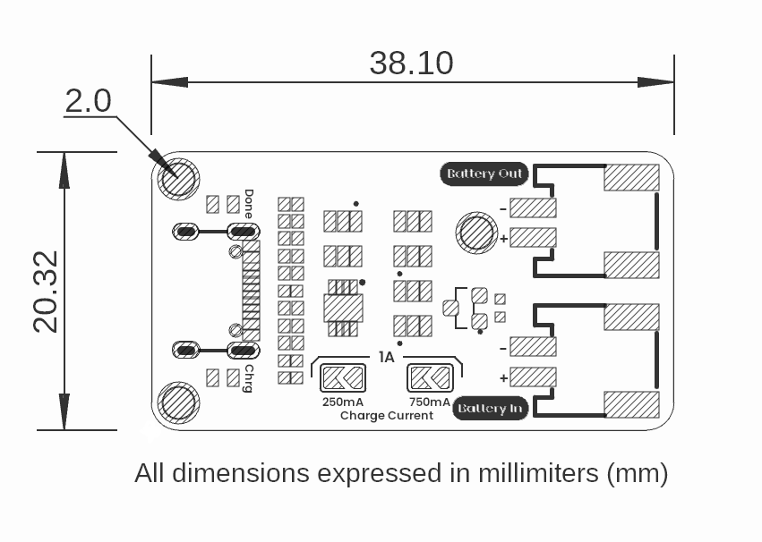

# Hardware

<a href="unit_sch_v_0_0_1_ue0089_cn3165_battery_charger.pdf">  Schematics</a>

# Pinout

<a href="resources/unit_pinout_v_0_0_1_ue0089_battery_charger_en.jpg">  Pinout</a>

| Component         | PCB Label   | Description                                         |
|-------------------|-----------  |---------------------------------------------------  |
| USB-C Connector   | USB IN      | 5 V power input from USB-C source                   |
| Connector         | Battery IN  | Screw terminals for connecting the Li-ion cell      |
| Connector         | Battery Out | Screw terminals for outputting battery voltage      |
| CHRG LED          | CHRG        | Indicator LED: on during the charging phase         |
| DONE LED          | DONE        | Indicator LED: on when the charging cycle completes |

---

# Dimensions

    <a href="resources/unit_dimensions_v_0_0_1_ue0089_cn3165_battery_charger.png"> Dimensions</a>
     

---

# Topology

    <a href="resources/unit_topology_v_0_0_1_ue0089_cn3165_battery_charger.png"> Topology</a>
     

# Board Topology

<a href="#">  Topology</a>

| Ref.  | Description                                                                 |
|-------|-----------------------------------------------------------------------------|
| IC1   | CN3165 Battery Charger IC                                                   |
| L1    | Charging LED                                                                |
| L2    | Charge Done LED                                                             |
| J1    | USB Type-C Connector                                                        |
| J2    | JST PH2.0 Connector for Battery Voltage Output                              |
| J3    | JST PH2.0 Connector for Battery Input                                       |
| SB1   | 200 mA Charging Current Solder Bridge                                       |
| SB2   | 700 mA Charging Current Solder Bridge                                       |
| SP1   | Solder Pads for Battery Output                                              |
| TP1   | Battery V- Test Point                                                       |
| TP2   | Battery V+ Test Point                                                       |
| TP3   | Charging LED Test Point                                                     |
| TP4   | Charge Done LED Test Point                                                  |

---

## Additional Resources

| Resource              | Link                                                                                                                        |
|:---------------------:|:---------------------------------------------------------------------------------------------------------------------------:|
| Wiki-UNIT Electronics | [Wiki - UNIT Electronics](https://unit-electronics-mx.github.io/wiki_uelectronics/es/docs/Modules/cn3165)                   |
| Github Repository     | [Github Repository](https://github.com/UNIT-Electronics-MX/unit_cn3165_battery_charger_module)                              |
| Product Brief         | [Product brief](../docs/unit_cn3165_battery_charger_module_product_brief.pdf)                                                   |
| Schematic             | [Schematic](unit_sch_v_0_0_1_ue0089_cn3165_battery_charger.pdf)                                                           |

